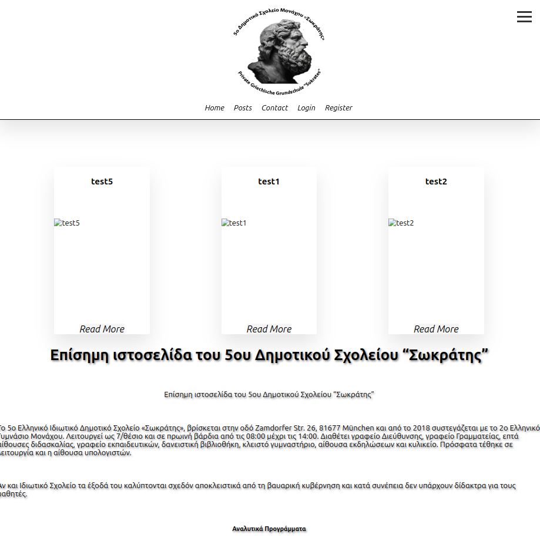
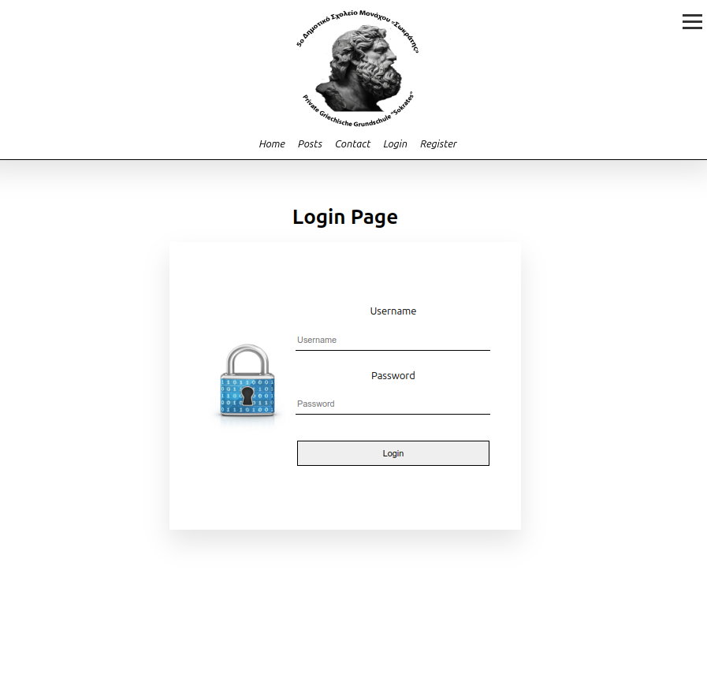
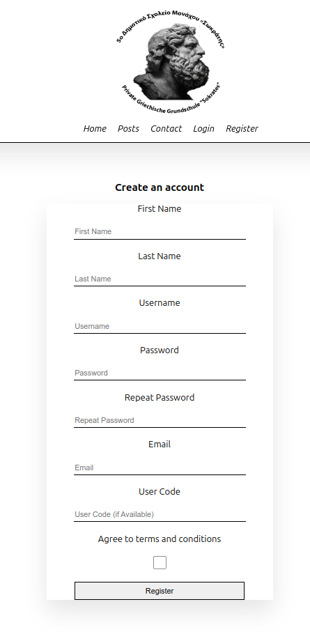
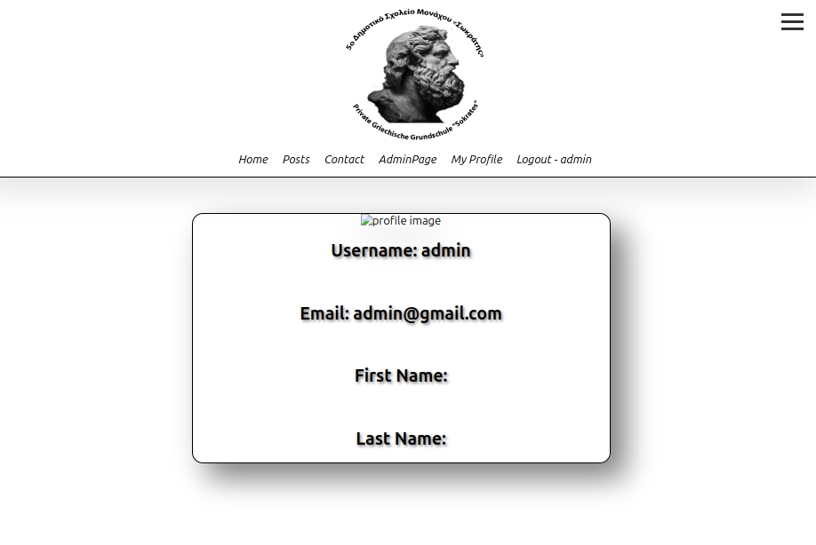
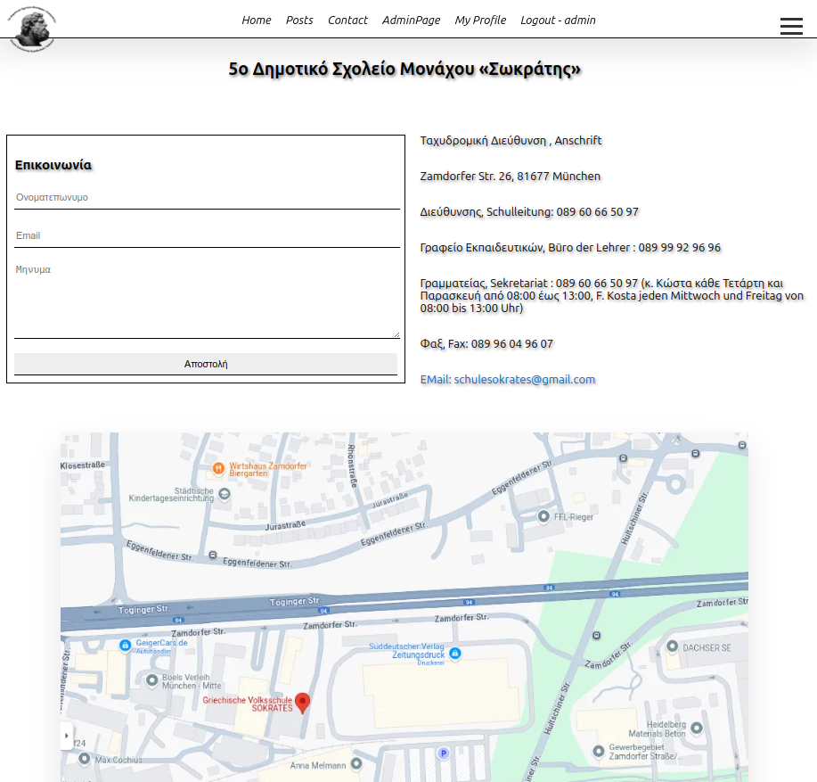
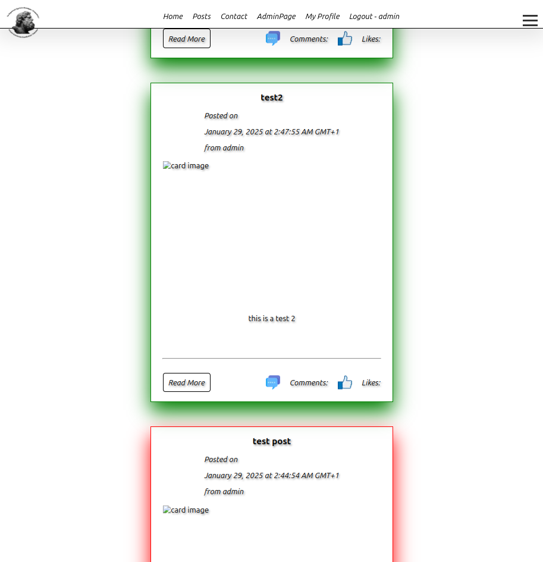
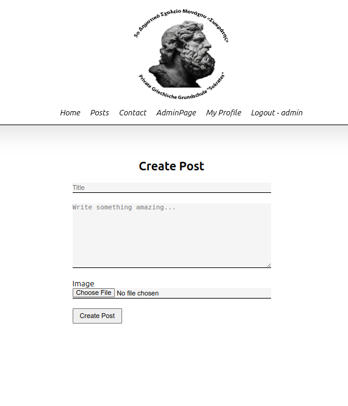
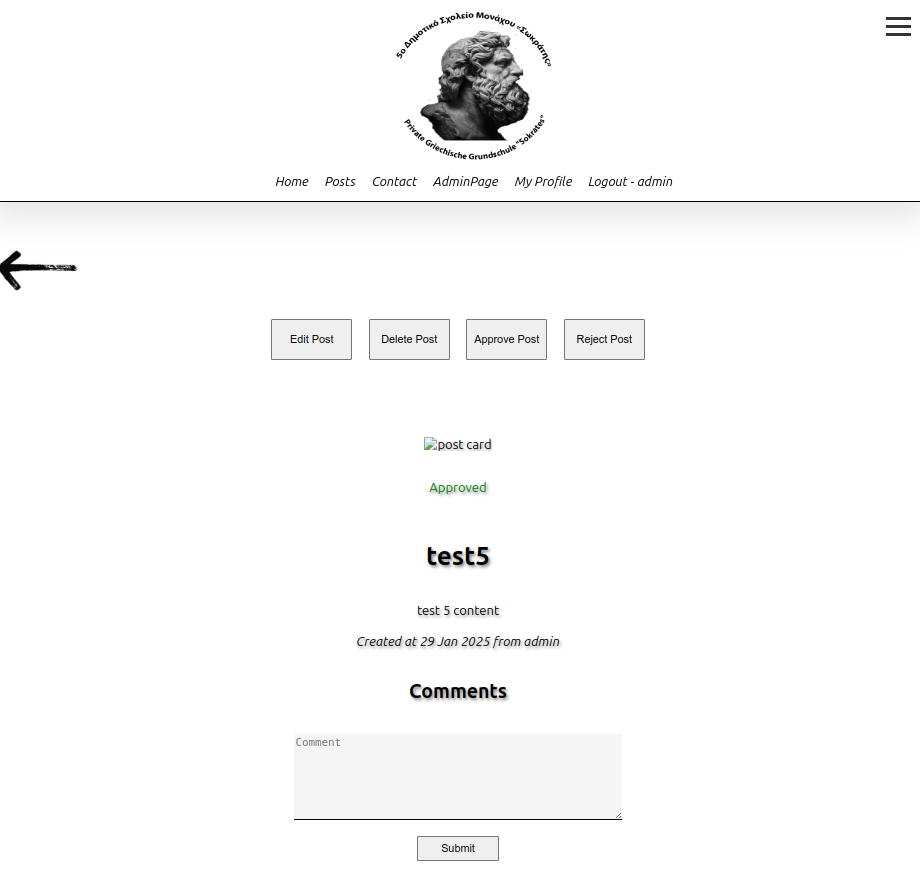
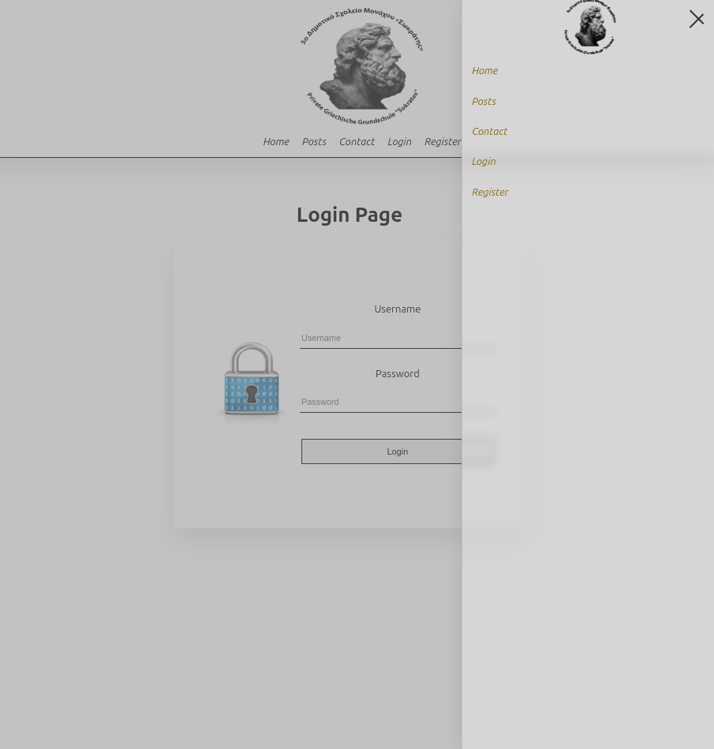

Visit :arrow_right:<a href="http://code5.ddns.net/">Sokrates Website</a>

# Sokrates

**Sokrates** is a *school webpage* and **blog system** where administrators and teachers can post updates or media files to inform guests and students.

> It is currently in **beta stage**, with more features coming soon.

## User Stories

## 1. User Registration
- **As a** new visitor  
- **I want to** register for an account by providing my email, username, and password  
- **So that** I can access additional features like logging in and posting comments  
---

## 2. User Login
- **As a** registered user  
- **I want to** log in by entering my username/email and password  
- **So that** I can access my account and participate in commenting  
---

## 4. Post Comment
- **As a** logged-in user  
- **I want to** post a comment on a blog post or article  
- **So that** I can share my opinion and engage with the content  
---

## 5. View Comments
- **As a** visitor or user  
- **I want to** view all comments on a blog post or article  
- **So that** I can read what other people are saying about the content  
---

## Future User Stories

## 6. Edit Comment
- **As a** logged-in user  
- **I want to** edit a comment I previously posted  
- **So that** I can correct mistakes or update my opinion  
---

## 7. Delete Comment
- **As a** logged-in user  
- **I want to** delete a comment I previously posted  
- **So that** I can remove content that I no longer want to be visible  
---

## 9. Like/Dislike Comment
- **As a** logged-in user  
- **I want to** like or dislike other users’ comments  
- **So that** I can express my agreement or disagreement with their opinions  
---

## 10. View Profile
- **As a** logged-in user  
- **I want to** view my profile page, including my comments and account settings  
- **So that** I can see my activity and manage my account  
---

This project followed an agile methodology using github project.

## Design 

### Colors and Backgrounds

The Website is on Black and White color scheme.

### Typography

The website uses a font called [Lato](https://fonts.google.com/specimen/Lato).

### Icons
No Icons are used in this project keep it simple.

## Backend

The backend uses a SQLite database and Django Rest Framework as the web framework. In a future update, it will be replaced with a PostgreSQL database.

### Database Design

The database design is as follows:

- **User**: A table that stores user information, including username, email, and password.
- **UserProfile**: A table that stores additional user profile information, such as first name, last name, and role.
- **Post**: A table that stores blog posts and their associated comments.
- **Comment**: A table that stores comments made by users.
- **Like**: A table that stores likes and dislikes made by users.

## Frontend

The frontend uses React.js as the web framework.

### Components

The components are as follows:

- **Header**: The header contains the logo and navigation links.
- **Footer**: The footer contains the copyright information.
- **Login**: The login page allows users to log in.
- **Register**: The register page allows users to create an account.
- **Home**: The home page displays the latest blog posts and comments.
- **Post**: The post page displays a single blog post and its comments.
- **Comment**: The comment page allows users to add comments to a blog post.
- **Profile**: The profile page displays a user's profile information and comments.

## Deployment

The project is deployed on a nginx server and can be accessed at [https://code5.ddns.net/](https://code5.ddns.net/). 

## Frontend Pictures

## Posts system

### Post Approval System  
- Only the **superuser** can approve posts for the public.  
- **Approved posts** have a **green background**.  
- **Rejected posts** have a **red background**.  
- Only **approved posts** are visible to guests and students.  

## Technical Details

- **Frontend**: React.js, Toaster library 
- **Backend**: Django Rest Framework
- **Database**: SQLite
- **Deployment**: Nginx, Docker, gunicorn
- **Version Control**: GitHub

### Cloning the Repository

Creating a clone allows you to make a local copy of the repository to run the project on your machine. Follow these steps to clone the repository:

1. Navigate to [Sokrates Repository](https://github.com/ozz1webdev/sokrates).
2. Click on the "**Code**" button at the top of the list of files.
3. Select the "**HTTPS**" option and copy the provided URL to your clipboard.
4. Open your code editor and, in the terminal, navigate to your desired directory.
5. Type `git clone` followed by the URL you copied.
6. Press Enter, and Git will clone the repository to your local machine.

By following these steps, you'll have a local copy of the Tech Corner project that you can modify and run as needed.

### Install Requirements for Virtual Environment

After Creating the Virtual Enviroment using pip3 : pip3 install -r requirements.txt

